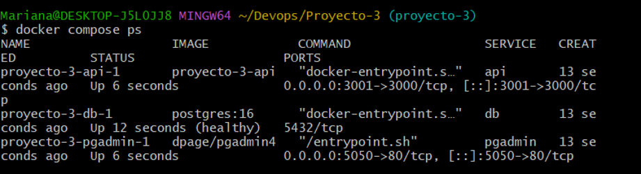
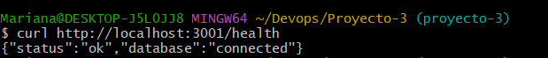
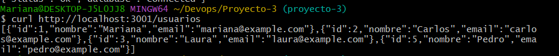
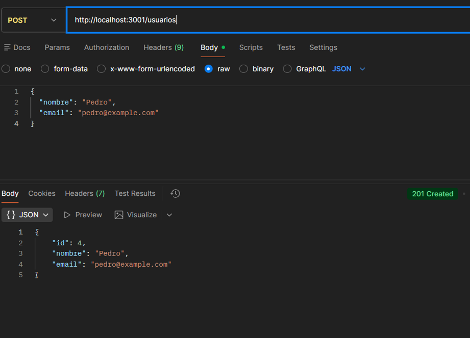
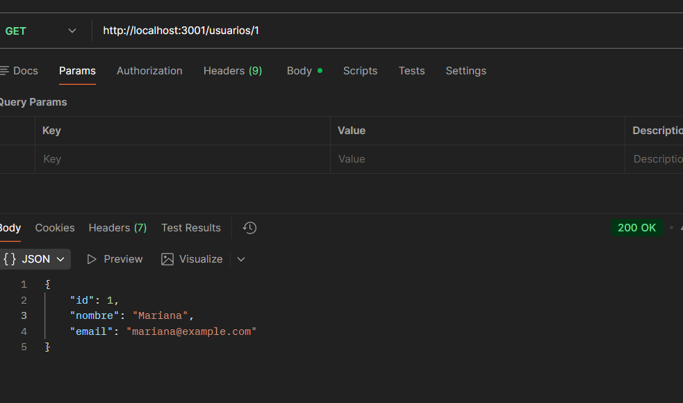
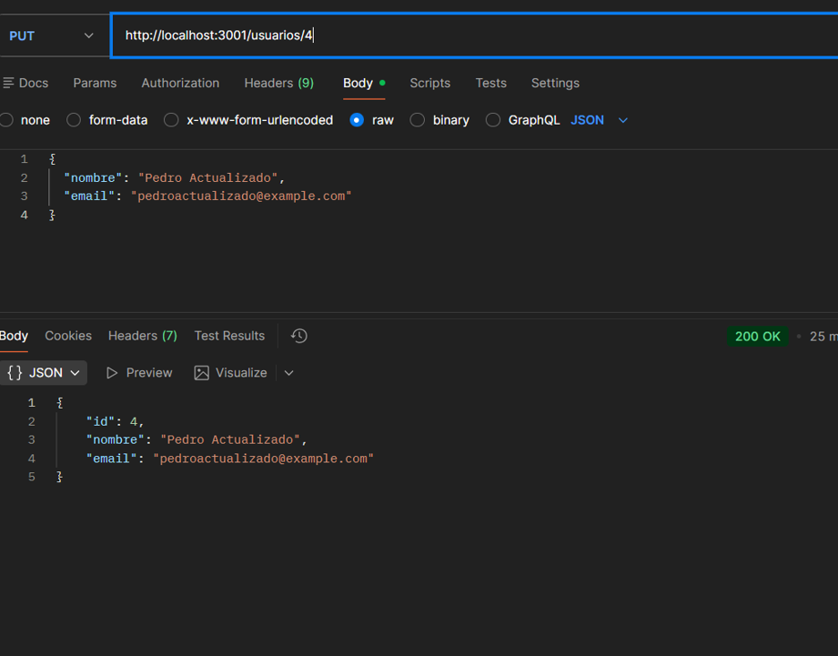
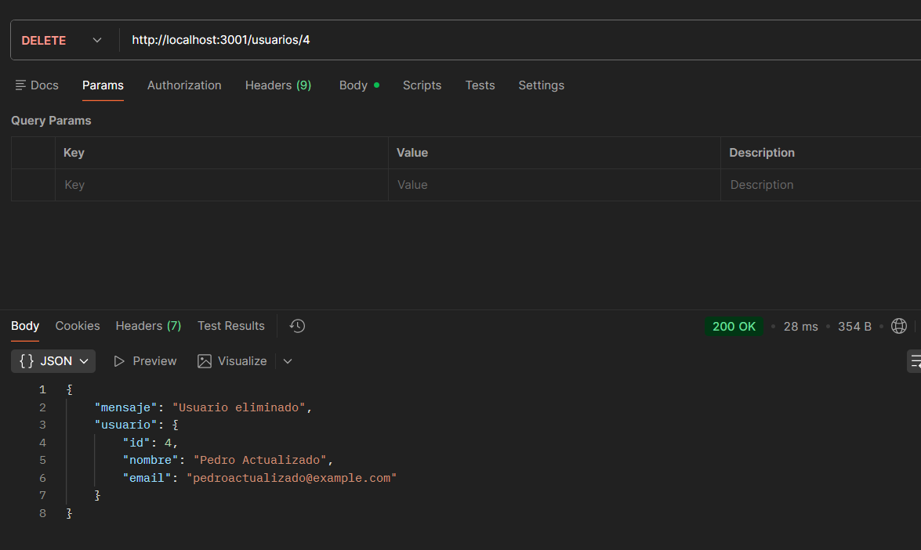
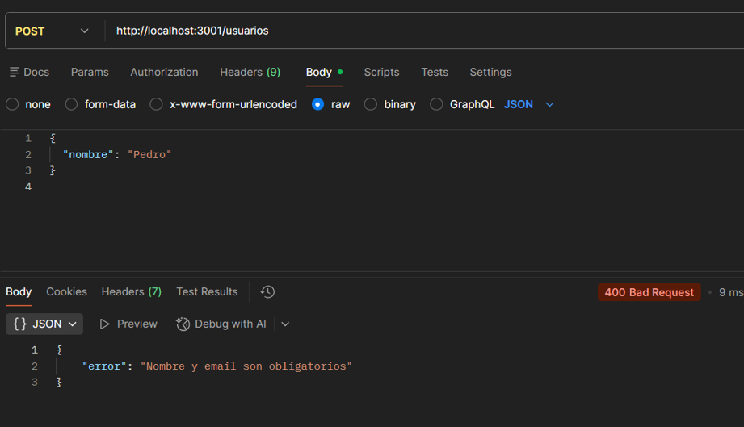
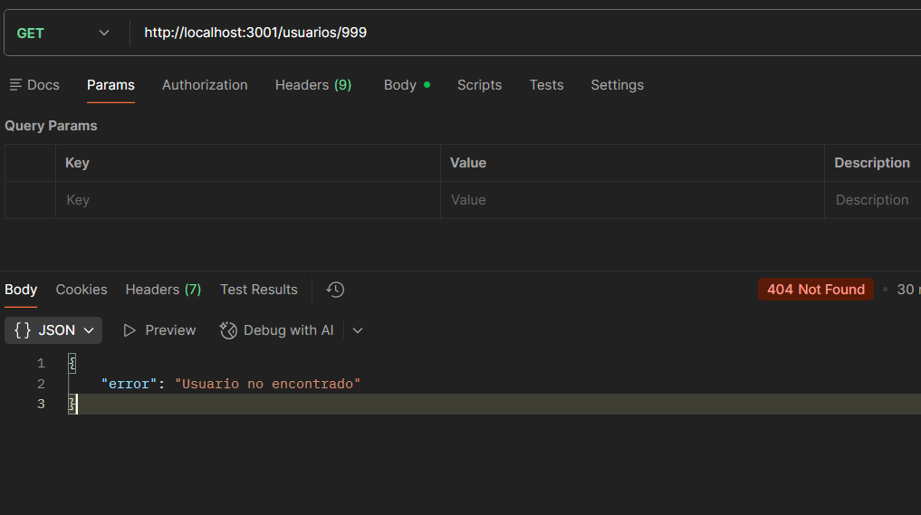
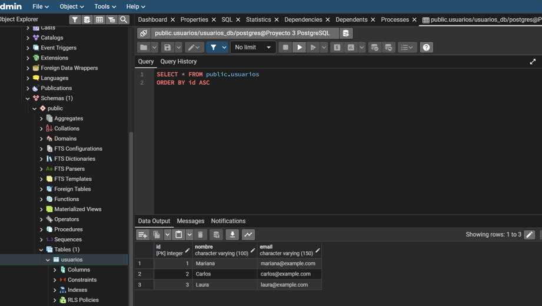

# 🚀 Proyecto 3 — API de Usuarios con PostgreSQL

## 📌 Descripción

Este proyecto consiste en una **API REST de usuarios** desarrollada con **Node.js y Express**, conectada a una base de datos **PostgreSQL**.

El proyecto utiliza **Docker Compose** para ejecutar los diferentes servicios de manera conjunta:

* API con Node.js y Express.
* PostgreSQL como base de datos.
* pgAdmin para administrar la base de datos.

La base de datos se inicializa automáticamente mediante un script SQL cuando se crea el volumen por primera vez.

---

## 🛠️ Tecnologías utilizadas

* Node.js
* Express
* PostgreSQL
* pgAdmin
* Docker
* Docker Compose
* Git y GitHub

---

# 📁 Estructura del proyecto

```text
Proyecto-3/
├── api/
│   ├── index.js
│   ├── package.json
│   └── package-lock.json
│
├── db/
│   └── init.sql
│
├── evidencias/
│   ├── docker-compose-ps.png
│   ├── health.png
│   ├── usuarios.png
│   ├── post.png
│   ├── get-id.png
│   ├── put.png
│   ├── delete.png
│   ├── error-400.png
│   ├── error-404.png
│   └── pgadmin.png
│
├── .env
├── .env.example
├── .gitignore
├── Dockerfile
├── docker-compose.yml
└── Makefile
```

> El archivo `.env` se mantiene únicamente de forma local y no se sube al repositorio.

---

# ⚙️ Funcionalidades

La API permite realizar las operaciones CRUD sobre usuarios:

* Consultar todos los usuarios.
* Consultar un usuario por su ID.
* Crear un usuario.
* Actualizar un usuario.
* Eliminar un usuario.
* Comprobar el estado de la API y la conexión con PostgreSQL.

También cuenta con validaciones para los datos recibidos.

---

# 🔗 Endpoints

| Método | Ruta            | Descripción                                                |
| ------ | --------------- | ---------------------------------------------------------- |
| GET    | `/health`       | Comprueba el estado de la API y la conexión con PostgreSQL |
| GET    | `/usuarios`     | Obtiene todos los usuarios                                 |
| GET    | `/usuarios/:id` | Obtiene un usuario específico                              |
| POST   | `/usuarios`     | Crea un nuevo usuario                                      |
| PUT    | `/usuarios/:id` | Actualiza un usuario                                       |
| DELETE | `/usuarios/:id` | Elimina un usuario                                         |

---

# 🗄️ Base de datos

La aplicación utiliza PostgreSQL para almacenar los usuarios.

La tabla `usuarios` contiene:

| Campo    | Tipo         | Descripción         |
| -------- | ------------ | ------------------- |
| `id`     | SERIAL       | Identificador único |
| `nombre` | VARCHAR(100) | Nombre del usuario  |
| `email`  | VARCHAR(150) | Correo electrónico  |

El archivo `db/init.sql` se encarga de crear la tabla y agregar registros iniciales.

PostgreSQL ejecuta este script automáticamente al crear el volumen de la base de datos por primera vez.

---

# 🐳 Docker

El proyecto utiliza un `Dockerfile` para construir la imagen propia de la API.

La imagen utiliza Node.js sobre Alpine y realiza la instalación de dependencias antes de copiar el código de la aplicación.

Docker Compose utiliza esta imagen mediante:

```yaml
api:
  build:
    context: .
    dockerfile: Dockerfile
```

Además, Docker Compose configura los siguientes servicios:

* `api`
* `db`
* `pgadmin`

Los servicios se comunican mediante una red interna de Docker.

---

# 🚀 Ejecución del proyecto

## 1. Configurar las variables de entorno

Se debe crear un archivo `.env` en la raíz del proyecto.

Ejemplo:

```env
POSTGRES_DB=usuarios_db
POSTGRES_USER=postgres
POSTGRES_PASSWORD=tu_password

DB_HOST=db
DB_PORT=5432
DB_NAME=usuarios_db
DB_USER=postgres
DB_PASSWORD=tu_password

API_PORT=3001

PGADMIN_EMAIL=admin@example.com
PGADMIN_PASSWORD=tu_password
PGADMIN_PORT=5050
```

También se incluye `.env.example` como referencia.

---

## 2. Construir y levantar los servicios

Desde la raíz del proyecto:

```bash
docker compose up -d --build
```

Este comando construye la imagen de la API y levanta los servicios de PostgreSQL, API y pgAdmin.

---

## 3. Verificar los servicios

```bash
docker compose ps
```

Los servicios deben aparecer ejecutándose y PostgreSQL debe mostrar el estado `healthy`.

### 📸 Evidencia



---

# 🩺 Comprobación de la API

El endpoint `/health` permite comprobar que la API está funcionando y que existe conexión con PostgreSQL.

```bash
curl http://localhost:3001/health
```

Respuesta esperada:

```json
{
  "status": "ok",
  "database": "connected"
}
```

### 📸 Evidencia



---

# 👥 Consulta de usuarios

Para consultar todos los usuarios:

```bash
curl http://localhost:3001/usuarios
```

La API obtiene los registros almacenados en PostgreSQL.

### 📸 Evidencia



---

# 🧪 Pruebas CRUD

Las operaciones CRUD fueron probadas utilizando la API.

## ➕ Crear usuario — POST

Endpoint:

```text
POST /usuarios
```

Ejemplo:

```json
{
  "nombre": "Pedro",
  "email": "pedro@example.com"
}
```

La API devuelve el usuario creado.

### 📸 Evidencia



---

## 🔎 Consultar usuario — GET

Endpoint:

```text
GET /usuarios/:id
```

Permite consultar un usuario específico mediante su ID.

### 📸 Evidencia



---

## ✏️ Actualizar usuario — PUT

Endpoint:

```text
PUT /usuarios/:id
```

Permite modificar los datos de un usuario existente.

### 📸 Evidencia



---

## 🗑️ Eliminar usuario — DELETE

Endpoint:

```text
DELETE /usuarios/:id
```

Permite eliminar un usuario existente.

### 📸 Evidencia



---

# ❌ Validaciones

La API valida los datos recibidos al crear y actualizar usuarios.

El nombre y el email son obligatorios y el email debe tener un formato válido.

Cuando los datos enviados no son válidos, la API responde:

```text
400 Bad Request
```

### 📸 Evidencia de validación



---

## 🔎 Usuario inexistente

Cuando se consulta, actualiza o elimina un usuario que no existe, la API responde:

```text
404 Not Found
```

### 📸 Evidencia



---

# 🖥️ pgAdmin

pgAdmin se utiliza para administrar y consultar la base de datos PostgreSQL.

Se puede acceder desde:

```text
http://localhost:5050
```

Para conectarse a PostgreSQL desde pgAdmin se utiliza el nombre del servicio de Docker:

```text
Host: db
Port: 5432
Database: usuarios_db
Username: postgres
```

El uso de `db` como host es posible porque los servicios se encuentran dentro de la misma red de Docker Compose.

### 📸 Evidencia de pgAdmin



---

# 🔄 Integración API y PostgreSQL

Los usuarios creados mediante la API son almacenados en PostgreSQL y pueden ser consultados posteriormente desde pgAdmin.

El flujo de funcionamiento es:

```text
Cliente
   ↓
API REST
   ↓
PostgreSQL
   ↓
pgAdmin
```

Esto permite comprobar que la API está trabajando correctamente con la base de datos.

---

# 🧰 Makefile

El proyecto incluye un `Makefile` para facilitar las operaciones principales.

```bash
make up
```

Levanta los servicios.

```bash
make down
```

Detiene los servicios.

```bash
make logs
```

Muestra los logs.

```bash
make test
```

Realiza una prueba del endpoint `/health`.

> En Windows puede ser necesario instalar `make` para ejecutar estos comandos.

---

# 🔐 Variables de entorno

Las variables de configuración se manejan mediante `.env`.

El archivo `.env` está incluido en `.gitignore` para evitar subir credenciales y configuraciones locales al repositorio.

Se incluye `.env.example` como plantilla para configurar el proyecto.

---

# 🌐 Puertos utilizados

| Servicio   | Puerto |
| ---------- | -----: |
| API        | `3001` |
| PostgreSQL | `5432` |
| pgAdmin    | `5050` |

---

# 📋 Comandos útiles

### Levantar el proyecto

```bash
docker compose up -d --build
```

### Detener los servicios

```bash
docker compose down
```

### Ver los contenedores

```bash
docker compose ps
```

### Ver todos los logs

```bash
docker compose logs -f
```

### Ver logs de la API

```bash
docker compose logs -f api
```

### Ver logs de PostgreSQL

```bash
docker compose logs -f db
```

---

# 👩‍💻 Proyecto

**Proyecto 3 — API de Usuarios con PostgreSQL**

Proyecto desarrollado como práctica de:

**Node.js · Express · PostgreSQL · pgAdmin · Docker Compose · Git**
